# Multi-Vendor Food Delivery Platform


**Food Delivery** is a comprehensive **Multi-Vendor Food Delivery** website and application, modeled after industry leaders like **Talabat** and **Elmenus**. It connects customers with a wide variety of restaurants, providing a seamless ordering and delivery experience.

---

## 📑 Table of Contents

- [About The Project](#about-the-project)
- [Comprehensive Feature List](#comprehensive-feature-list)
  - [Profile Management](#profile-management)
  - [Browsing & Discovery](#browsing--discovery)
  - [Cart Management](#cart-management)
  - [Order Management](#order-management)
  - [Payment & Wallet](#payment--wallet)
  - [Offers & Rewards](#offers--rewards)
  - [Localization & Settings](#localization--settings)
  - [Notifications](#notifications)
  - [Restaurant Dashboard](#restaurant-dashboard)
  - [Super Admin Panel](#super-admin-panel)
  - [Support & Communication](#support--communication)
  - [AI & Personalization](#ai--personalization)
  - [Reviews & Ratings](#reviews--ratings)
  - [Advanced Logistics](#advanced-logistics)
  - [Database Design](#database-design)
  - [System Flowcharts](#system-flowcharts)
- [Getting Started](#getting-started)


---

## ℹ️ About The Project

Food Delivery is designed to be a scalable, multi-country, and multi-language platform that handles the entire food delivery lifecycle. From high-level restaurant management to granular cart operations, every aspect of the user journey is optimized for speed and convenience.

---

## 🚀 Comprehensive Feature List

Below is a detailed breakdown of every functionality available in the platform.

### 👤 Profile Management
Complete control over user identity and preferences.
*   **Login**: Secure access via phone number or email.
*   **Register**: Create a new account with verification.
*   **Reset Password**: Recover account access via OTP.
*   **Change Password**: Update security credentials.
*   **View Profile**: Access personal details.
*   **Edit Profile**: Update name, email, and photo.
*   **Multiple Addresses**:
    *   Add new address (Home, Work, etc.).
    *   Edit existing address details.
    *   Delete address.
    *   Set default address.
    *   Pin location on map.

### 🔍 Browsing & Discovery
Tools to find the perfect meal.
*   **View Restaurants**: Browse a list of all available vendors.
*   **View Categories**: Explore by cuisine (Pizza, Burger, Sushi).
*   **View Products**: Detailed product pages with images and descriptions.
*   **Filtering**: Sort by rating, delivery time, or price.
*   **Search**:
    *   Search for restaurants.
    *   Search for specific food items.
*   **Geolocation**:
    *   **Nearest Restaurants**: Auto-detect user location to sort restaurants by distance (Nearest First).

### 🛒 Cart Management
A flexible shopping cart system.
*   **Add to Cart**: Add items with selected options.
*   **Edit Cart**: Modify item preferences (e.g., remove topping).
*   **Add/Edit Quantity**: Increase or decrease item counts.
*   **View Cart**: Summary of items, taxes, and subtotal.
*   **Delete All Items**: Clear the entire cart in one click.
*   **Single Vendor Enforcement**: Prompts user when adding items from a different restaurant.

### 📦 Order Management
Complete lifecycle management from placement to delivery.
*   **Place Order**: Seamless checkout flow with step-by-step confirmation.
*   **Order Cancellation**:
    *   **By Customer**: Cancel orders within a specific timeframe (with refund logic).
    *   **By Restaurant**: Cancel orders due to stock issues or closing hours.
*   **Order Tracking**:
    *   **Status Updates**: Real-time tracking (Pending -> Preparing -> Out for Delivery -> Delivered).
    *   **Notifications**: Instant alerts to customers on status changes.
*   **Order History**:
    *   **Customer View**: Past orders list with re-order capability.
    *   **Restaurant View**: History of all fulfilled and canceled orders.
*   **Order Details**:
    *   **Summary**: Quick view of items and total price.
    *   **Detailed View**: Comprehensive breakdown including taxes, delivery fees, and notes.
*   **Confirmations**: Automated Email and SMS verification upon success.
*   **Payment Methods**:
    *   **Cash on Delivery**: Pay in cash upon arrival.
    *   **Online Payment**: Pay via Credit/Debit card.
    *   **Wallet Payment**: Deduct total from internal wallet balance.

### 💳 Payment & Wallet
Integrated financial ecosystem with robust auditing.
*   **Core Integration**:
    *   **API Endpoints**: RESTful APIs for initiating, verifying, and refunding transactions.
    *   **3rd Party Integration**: Seamless connection with major gateways (Stripe, PayPal, Local Providers).
    *   **Multiple Methods**: Support for Credit Cards, Debit Cards, Digital Wallets, and COD.
*   **Transaction Management**:
    *   **View Transactions**: Detailed history of all credits, debits, and transfers.
    *   **Payment Status**: Real-time tracking (Pending, Completed, Failed, Refunded, Voided).
    *   **Receipts**: Automated generation of digital receipts for every successful transaction.
*   **Security & Reliability**:
    *   **Verification & Validation**: Server-side checks to ensure transaction integrity.
    *   **Error Handling**: Graceful failure management with user-friendly error messages.
*   **Auditing**:
    *   **Payment Auditing**: Complete logs of every payment attempt, including request/response payloads.
    *   **Financial Auditing**: Tools for reconciling platform revenue vs. vendor payouts.

### 🎁 Offers & Rewards
Loyalty and promotion systems.
*   **Coupons**: Apply promo codes for discounts at checkout.
*   **Offers**: Browse restaurant-specific deals (e.g., Buy 1 Get 1).
*   **Rewards System**: Earn points on every order.
*   **Redeem Points**: Convert points into wallet balance or discounts.

### 🌍 Localization & Settings
Built for a global audience.
*   **Multi-Language**: Toggle between Arabic, English, and other languages.
*   **Multi-Countries**: Support for different currencies and regions.
*   **Auto-Country Detection**: App automatically identifies user's country via IP/GPS on launch to serve relevant content and currency.

### 🔔 Notifications
Keep users informed at every step.
*   **SMS Integration**: verification codes and critical updates.
*   **Email Integration**: Order receipts and marketing campaigns.
*   **Push Notifications**: Real-time order status updates.

### 🍳 Restaurant Dashboard
Comprehensive tools for vendors to manage their business.
*   **Reports & Analytics**:
    *   **Sales Reports**: Daily, weekly, and monthly revenue breakdowns.
    *   **Earnings & Commissions**: Track net earnings after platform fees.
    *   **Top Performers**: Identify top-selling items and categories.
    *   **Order Analysis**: Volume and status breakdown (accepted, rejected, delivered).
    *   **Customer Insights**: Review analysis and ratings.
    *   **Inventory Alerts**: Low stock notifications.
*   **Menu Management**:
    *   **Categories**: Add, edit, and organize menu sections.
    *   **Products**: detailed item creation (images, prices, descriptions, calories).
    *   **Ingredients**: Track raw materials and map them to products (e.g., Tomato, Cheese).
    *   **Variants & Add-ons**: Manage sizes, toppings, and required choices.
*   **Logistics & Settings**:
    *   **Shipment Cost**: Set delivery fees based on distance or zones.
    *   **Store Settings**: Manage operating hours and "Busy Mode" toggles.
*   **Order Management**:
    *   **List Orders**: Real-time view of incoming, processing, and ready orders.
    *   **Status Control**: Accept, reject, prepare, and mark orders as ready.
*   **Employee Management**:
    *   **Staff Profiles**: Create accounts for employees (managers, sales, support) via the specific `Admins` table.
    *   **Role Management**: Assign custom roles (e.g., "Menu Editor") with granular permissions to restrict access.

### 🛡️ Super Admin Panel
Global control center for platform owners.
*   **Admin Authentication**:
    *   **Dedicated Login**: Separate authentication flow for Dashboard Admins vs Customers.
    *   **RBAC**: Full Role-Based Access Control for managing internal teams.
*   **Global Overview**:
    *   **Analytics**: View aggregate reports across all restaurants or filter by specific ones.
    *   **Financials**: Monitor total platform revenue, commissions, and payouts.
*   **Restaurant Management**:
    *   **Onboarding**: Add new restaurants and configure initial settings.
    *   **Assignment**: specific restaurants to specific vendors/users.
*   **User Management**:
    *   **Global Access**: Manage all customers, drivers, and vendor accounts.

### 💬 Support & Communication
Direct lines for customer assistance.
*   **Live Chat**: Real-time messaging with support agents for immediate issue resolution.
*   **Contact Us**: Dedicated forms for general inquiries, complaints, and feedback.

### 🤖 AI & Personalization
Smart features for a tailored experience.
*   **Smart Recommendations**: AI-driven restaurant and meal suggestions based on order history and preferences.

### ⭐ Reviews & Ratings
Community-driven quality assurance.
*   **Order Reviews**: Rate and review specific orders.
*   **Item Reviews**: Comment on individual food items.
*   **Interactive Comments**: Threaded replies between customers and vendors.

### 🚚 Advanced Logistics
Robust delivery infrastructure.
*   **3rd Party Integration**: Connect with shipment providers (Uber Direct, Local Couriers) via API.
*   **Real-time Tracking**: Granular location updates from the logistics provider.
*   **Driver Assignment**: Auto or manual assignment of drivers to shipments.

---

## 💾 Database Design

The platform relies on a robust schema to handle high-frequency transactions. Below is the Entity-Relationship Diagram (ERD) for the core modules.


### Key Modules
*   **Cart Module**: Enforces single-vendor constraints via `restaurant_id`.
*   **Order Module**: Snapshot architecture (`order_items`) preserves historical pricing.
*   **Payment Module**: Comprehensive auditing (`payment_audits`) and raw gateway logs (`transaction_details`).

---

### 📚 Detailed Schema Definitions

#### 🛒 Cart Module
*   **carts**: `id` (PK), `user_id`, `restaurant_id`, `session_id`, `total_amount`.
*   **cart_items**: `id`, `cart_id`, `product_id`, `quantity`, `price`, `options`.

#### 📦 Order Module
*   **orders**: `id` (PK), `user_id`, `restaurant_id`, `status_id`, `subtotal`, `delivery_fee`, `tax`, `discount`, `total_amount`, `coupon_code`.
*   **order_items**: `id`, `order_id`, `product_id`, `name`, `quantity`, `unit_price`, `total_price`, `options`.
*   **order_history**: `id`, `order_id`, `status_id`, `changed_by_user_id`, `reason`.

#### 💳 Payment & Transaction Module
*   **transactions**: `id` (PK), `order_id`, `user_id`, `amount`, `currency`, `type_id`, `status_id`, `reference`.
*   **transaction_details**: `transaction_id`, `gateway_response`, `error_message`, `ip_address`.
*   **transaction_history**: `transaction_id`, `status_from`, `status_to`.
*   **payment_audits**: `transaction_id`, `action`, `performed_by`, `old_values`, `new_values`.
*   **wallets**: `user_id`, `balance`, `currency`.
*   **wallet_transactions**: `wallet_id`, `type`, `amount`, `reference_type`.
*   **wallet_audits**: `wallet_id`, `action`, `performed_by`, `old_balance`, `new_balance`.

#### 🍽️ Restaurant & Menu Module
*   **super_categories**: `id`, `name`, `image_url`.
*   **restaurants**: `id`, `owner_id`, `super_category_id`, `name`, `description`, `rating`.
*   **menu_categories**: `id`, `restaurant_id`, `name`.
*   **menu_items**: `id`, `menu_category_id`, `name`, `price`, `calories`.
*   **ingredients**: `id`, `restaurant_id`, `name`, `unit`.

#### 🗄️ Archival Module
*   **order_archives**: `id`, `original_order_id`, `final_status`, `order_data_snapshot`.
*   **order_archive_items**: `id`, `archive_id`, `product_name`, `quantity`.

#### 🛡️ Admin & RBAC Module
*   **admins**: `id`, `name`, `email`, `role_id`, `restaurant_id` (nullable).
*   **roles**: `id`, `name`, `guard_name`.
*   **permissions**: `id`, `name`, `guard_name`.

#### 👤 User Management Module
*   **users**: `id`, `name`, `email`, `phone`, `role` (super_admin, vendor, customer, driver), `fcm_token`.
*   **user_addresses**: `id`, `user_id`, `address_line`, `lat`, `lng`.

#### 🚚 Shipment & Delivery Module
*   **shipments**: `id`, `order_id`, `provider_id`, `driver_id`, `tracking_number`, `status`.
*   **shipment_tracking**: `shipment_id`, `lat`, `lng`, `status_message`.

#### 📊 Reporting Module
*   **daily_sales_reports**: `restaurant_id`, `date`, `total_orders`, `total_revenue`.
*   **reviews**: `user_id`, `order_id`, `restaurant_id`, `rating`, `comment`.

---

## 🔄 System Flowcharts

Visualizing the core logic of the platform.

### Place Order & Lifecycle Flow

This chart demonstrates the user journey from checkout to delivery, including branching payment logic.

```mermaid
flowchart TD
    Start([User Initiates Checkout]) --> InputInfo[Enter Personal Info & Address]
    InputInfo --> Method{Select Payment Details}

    %% Payment Logic
    Method -- "💳 Online Payment" --> Gateway[Redirect to Payment Gateway]
    Gateway -->|Success| Verify[Verify Transaction]
    Gateway -->|Fail| P_Fail([Payment Failed])
    Verify -->|Verified| P_Success[Payment Successful]

    Method -- "🪙 Wallet" --> BalCheck{Check Balance}
    BalCheck -->|Insufficient| W_Fail([Insufficient Funds])
    BalCheck -->|Sufficient| Deduct[Deduct Amount]
    Deduct --> P_Success

    Method -- "💵 Cash (COD)" --> LimitCheck{Check COD Limit}
    LimitCheck -->|Exceeds| C_Fail([Order Limit Exceeded])
    LimitCheck -->|Allowed| P_Success

    %% Order Lifecycle
    P_Success --> DraftOrder[Create Order Record]
    DraftOrder --> NotifyRest[Notify Restaurant]
    NotifyRest --> RestAction{Restaurant Response}

    RestAction -- "Reject" --> Refund{Payment Type?}
    Refund -- "Online/Wallet" --> AutoRefund[Reverse Transaction/Refund to Wallet]
    Refund -- "COD" --> Void[Void Order]
    AutoRefund --> Cancelled([Order Cancelled])
    Void --> Cancelled

    RestAction -- "Accept" --> Kitchen[Preparing Food]
    Kitchen --> Ready[Order Ready]
    Ready --> AssignDriver[Assign Driver]
    AssignDriver --> Pickup[Driver Picks Up]
    Pickup --> Transit[In Transit]
    Transit --> Handover[Delivered to Customer]
    Handover --> Complete([Order Complete])
```



---

### 📡 Place Order: Sequence Diagram

Technical interaction between the Mobile App, Backend API, and Third-Party Services.


### 📝 Logic Pseudocode

Basic algorithm for the order placement API.

```python
FUNCTION PlaceOrder(user_id, cart_id, payment_method, address_id):
    # 1. Validation
    IF NOT ValidateCart(cart_id):
        RETURN Error("Invalid Cart")
    
    # 2. Inventory Check
    FOR item IN cart_items:
        IF item.stock < item.quantity:
            RETURN Error("Item " + item.name + " Out of Stock")

    # 3. Financials
    subtotal = CalculateSubtotal(cart_items)
    tax = subtotal * 0.14
    delivery_fee = CalculateShipping(address_id)
    total = subtotal + tax + delivery_fee

    # 4. Payment Processing
    TRY:
        IF payment_method == "ONLINE":
            transaction = PaymentGateway.Charge(total)
        ELSE IF payment_method == "WALLET":
            IF Wallet.Balance(user_id) < total:
                RETURN Error("Insufficient Funds")
            Wallet.Deduct(user_id, total)
        
        # 5. Persistence
        DB.BeginTransaction()
        order = DB.CreateOrder(user_id, total, status="PENDING")
        DB.CreateOrderItems(order.id, cart_items)
        DB.CreateTransaction(order.id, payment_method, "SUCCESS")
        DB.Commit()

        # 6. Notifications
        SendPushNotification(restaurant_owner, "New Order Received")
        RETURN Success(order)

    CATCH Exception:
        DB.Rollback()
        RETURN Error("Order Failed")
```

---


