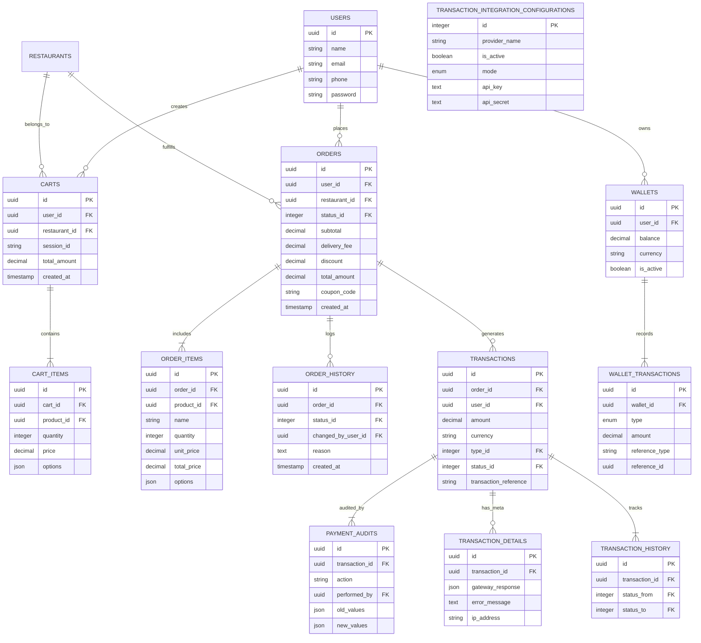

# Multi-Vendor Food Delivery Platform

**Food Delivery** is a comprehensive **Multi-Vendor Food Delivery** website and application, modeled after industry leaders like **Talabat** and **Elmenus**. It connects customers with a wide variety of restaurants, providing a seamless ordering and delivery experience.

---

## 📑 Table of Contents

- [About The Project](#about-the-project)
- [Comprehensive Feature List](#comprehensive-feature-list)
  - [Profile Management](#profile-management)
  - [Browsing & Discovery](#browsing--discovery)
  - [Cart Management](#cart-management)
  - [Order Management](#order-management)
  - [Payment & Wallet](#payment--wallet)
  - [Offers & Rewards](#offers--rewards)
  - [Localization & Settings](#localization--settings)
  - [Notifications](#notifications)
  - [Restaurant Dashboard](#restaurant-dashboard)
  - [Super Admin Panel](#super-admin-panel)
  - [Support & Communication](#support--communication)
  - [AI & Personalization](#ai--personalization)

---

## ℹ️ About The Project

Food Delivery is designed to be a scalable, multi-country, and multi-language platform that handles the entire food delivery lifecycle. From high-level restaurant management to granular cart operations, every aspect of the user journey is optimized for speed and convenience.

---

## 🚀 Comprehensive Feature List

Below is a detailed breakdown of every functionality available in the platform.

### 👤 Profile Management
Complete control over user identity and preferences.
*   **Login**: Secure access via phone number or email.
*   **Register**: Create a new account with verification.
*   **Reset Password**: Recover account access via OTP.
*   **Change Password**: Update security credentials.
*   **View Profile**: Access personal details.
*   **Edit Profile**: Update name, email, and photo.
*   **Multiple Addresses**:
    *   Add new address (Home, Work, etc.).
    *   Edit existing address details.
    *   Delete address.
    *   Set default address.
    *   Pin location on map.

### 🔍 Browsing & Discovery
Tools to find the perfect meal.
*   **View Restaurants**: Browse a list of all available vendors.
*   **View Categories**: Explore by cuisine (Pizza, Burger, Sushi).
*   **View Products**: Detailed product pages with images and descriptions.
*   **Filtering**: Sort by rating, delivery time, or price.
*   **Search**:
    *   Search for restaurants.
    *   Search for specific food items.
*   **Geolocation**:
    *   **Nearest Restaurants**: Auto-detect user location to sort restaurants by distance (Nearest First).

### 🛒 Cart Management
A flexible shopping cart system.
*   **Add to Cart**: Add items with selected options.
*   **Edit Cart**: Modify item preferences (e.g., remove topping).
*   **Add/Edit Quantity**: Increase or decrease item counts.
*   **View Cart**: Summary of items, taxes, and subtotal.
*   **Delete All Items**: Clear the entire cart in one click.
*   **Single Vendor Enforcement**: Prompts user when adding items from a different restaurant.

### 📦 Order Management
Complete lifecycle management from placement to delivery.
*   **Place Order**: Seamless checkout flow with step-by-step confirmation.
*   **Order Cancellation**:
    *   **By Customer**: Cancel orders within a specific timeframe (with refund logic).
    *   **By Restaurant**: Cancel orders due to stock issues or closing hours.
*   **Order Tracking**:
    *   **Status Updates**: Real-time tracking (Pending -> Preparing -> Out for Delivery -> Delivered).
    *   **Notifications**: Instant alerts to customers on status changes.
*   **Order History**:
    *   **Customer View**: Past orders list with re-order capability.
    *   **Restaurant View**: History of all fulfilled and canceled orders.
*   **Order Details**:
    *   **Summary**: Quick view of items and total price.
    *   **Detailed View**: Comprehensive breakdown including taxes, delivery fees, and notes.
*   **Confirmations**: Automated Email and SMS verification upon success.
*   **Payment Methods**:
    *   **Cash on Delivery**: Pay in cash upon arrival.
    *   **Online Payment**: Pay via Credit/Debit card.
    *   **Wallet Payment**: Deduct total from internal wallet balance.

### 💳 Payment & Wallet
Integrated financial ecosystem with robust auditing.
*   **Core Integration**:
    *   **API Endpoints**: RESTful APIs for initiating, verifying, and refunding transactions.
    *   **3rd Party Integration**: Seamless connection with major gateways (Stripe, PayPal, Local Providers).
    *   **Multiple Methods**: Support for Credit Cards, Debit Cards, Digital Wallets, and COD.
*   **Transaction Management**:
    *   **View Transactions**: Detailed history of all credits, debits, and transfers.
    *   **Payment Status**: Real-time tracking (Pending, Completed, Failed, Refunded, Voided).
    *   **Receipts**: Automated generation of digital receipts for every successful transaction.
*   **Security & Reliability**:
    *   **Verification & Validation**: Server-side checks to ensure transaction integrity.
    *   **Error Handling**: Graceful failure management with user-friendly error messages.
*   **Auditing**:
    *   **Payment Auditing**: Complete logs of every payment attempt, including request/response payloads.
    *   **Financial Auditing**: Tools for reconciling platform revenue vs. vendor payouts.

### 🎁 Offers & Rewards
Loyalty and promotion systems.
*   **Coupons**: Apply promo codes for discounts at checkout.
*   **Offers**: Browse restaurant-specific deals (e.g., Buy 1 Get 1).
*   **Rewards System**: Earn points on every order.
*   **Redeem Points**: Convert points into wallet balance or discounts.

### 🌍 Localization & Settings
Built for a global audience.
*   **Multi-Language**: Toggle between Arabic, English, and other languages.
*   **Multi-Countries**: Support for different currencies and regions.
*   **Auto-Country Detection**: App automatically identifies user's country via IP/GPS on launch to serve relevant content and currency.

### 🔔 Notifications
Keep users informed at every step.
*   **SMS Integration**: verification codes and critical updates.
*   **Email Integration**: Order receipts and marketing campaigns.
*   **Push Notifications**: Real-time order status updates.

### 🍳 Restaurant Dashboard
Comprehensive tools for vendors to manage their business.
*   **Reports & Analytics**:
    *   **Sales Reports**: Daily, weekly, and monthly revenue breakdowns.
    *   **Earnings & Commissions**: Track net earnings after platform fees.
    *   **Top Performers**: Identify top-selling items and categories.
    *   **Order Analysis**: Volume and status breakdown (accepted, rejected, delivered).
    *   **Customer Insights**: Review analysis and ratings.
    *   **Inventory Alerts**: Low stock notifications.
*   **Menu Management**:
    *   **Categories**: Add, edit, and organize menu sections.
    *   **Products**: detailed item creation (images, prices, descriptions, calories).
    *   **Variants & Add-ons**: Manage sizes, toppings, and required choices.
*   **Logistics & Settings**:
    *   **Shipment Cost**: Set delivery fees based on distance or zones.
    *   **Store Settings**: Manage operating hours and "Busy Mode" toggles.
*   **Order Management**:
    *   **List Orders**: Real-time view of incoming, processing, and ready orders.
    *   **Status Control**: Accept, reject, prepare, and mark orders as ready.
*   **Employee Management**:
    *   **Staff Profiles**: Create accounts for employees (managers, sales, support).
    *   **Role Management**: Assign specific permissions to each employee.

### 🛡️ Super Admin Panel
Global control center for platform owners.
*   **Global Overview**:
    *   **Analytics**: View aggregate reports across all restaurants or filter by specific ones.
    *   **Financials**: Monitor total platform revenue, commissions, and payouts.
*   **Restaurant Management**:
    *   **Onboarding**: Add new restaurants and configure initial settings.
    *   **Assignment**: specific restaurants to specific vendors/users.
*   **User Management**:
    *   **Global Access**: Manage all customers, drivers, and vendor accounts.

### 💬 Support & Communication
Direct lines for customer assistance.
*   **Live Chat**: Real-time messaging with support agents for immediate issue resolution.
*   **Contact Us**: Dedicated forms for general inquiries, complaints, and feedback.

### 🤖 AI & Personalization
Smart features for a tailored experience.
*   **Smart Recommendations**: AI-driven restaurant and meal suggestions based on order history and preferences.

---

## 💾 Database Design

The platform relies on a robust schema to handle high-frequency transactions. Below is the Entity-Relationship Diagram (ERD) for the core modules.

### Key Modules
*   **Cart Module**: Enforces single-vendor constraints via `restaurant_id`.
*   **Order Module**: Snapshot architecture (`order_items`) preserves historical pricing.
*   **Payment Module**: Comprehensive auditing (`payment_audits`) and raw gateway logs (`transaction_details`).

---

